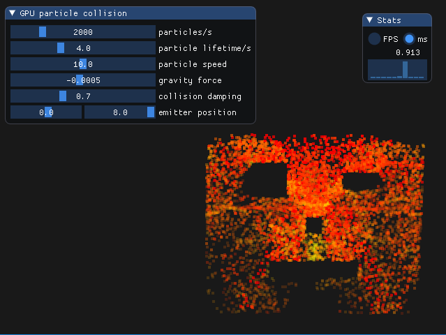

# myVulkan

Linux: 

myVulkan is my personal Vulkan rendering framework.

## Examples

### Third party software

- [GLFW](https://github.com/glfw/glfw)
- [glm](https://github.com/g-truc/glm)
- [imgui](https://github.com/ocornut/imgui)
- [googletest](https://github.com/google/googletest)
- [stb](https://github.com/nothings/stb)
- [tinyobjloader](https://github.com/syoyo/tinyobjloader)
